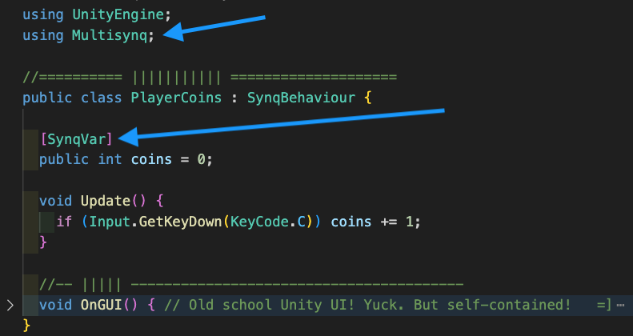

Multisynq for Unity (M4U) is a Unity package that easily adds multiplayer to Unity games.

Skip the server code. Just add `[SynqVar]` and `[SynqRPC]` to any MonoBehaviour field or method, drop in an API key and you've got multiplayer running everywhere: Unity editor, built native, or WebGL.

Easy for simple projects, but scales to enable traffic-reducing, deterministic, bit-identical multiplayer-synchronization (multi-synq `=]` ).

Let's go. [Installing M4U](./build_assistant-installation.html)

Migrating over from Photon? Check out our [Migration Guide](./photon_migration_guide.html)

## Overview

[`Multisynq for Unity`](https://github.com/multisynq/m4u-package) is a Multiplayer Package that helps you to build synchronized, bit-identical simulations with JavaScript. Deploy effortlessly everywhere without the hassle of server management, complex netcode, or rollback. Author how something behaves once, and it will behave that way for everyone playing your game. Snapshots? Handled. Catchup state? Handled.

- Model/View architecture with client deterministic synchronized computation eliminates netcode.
- Eliminate tons of network traffic due to client deterministic architecture.

Here's the GitHub repo: [`https://github.com/multisynq/m4u-package`](https://github.com/multisynq/m4u-package).

This guide is quite handy to get going: [Installing M4U](./build_assistant-installation.html)

## How easy?

- Add C# attributes to your fields and methods.
  - `[SynqVar]` and `[SynqRPC]` (RPC = Remote Procedure Call)
- Swap MonoBehaviour for SynqBehaviour.
- Get the build assistant to all green checkmarks

*Like this:*

## The M4U Build Assistant

If only there was a checklist to get everything ready to run and build. Oh wait, there is.

The Build Assistant checks all the settings you'll need to get going and automatically troubleshoots stuff that might get in your way. From new scene to multiplayer calls and values, the build assistant has got your back.

## Video guide

<video width="100%" height="100%" style="border-radius: 1rem" controls>
  <source src="videos/m4u-demo_1.mp4" type="video/mp4">
</video>

## Deterministic (Advanced) Tutorials

Multiplayer (usually) has lots of limitations. Need a hoard of 5000 network-synched monsters? Ouch. Crazy physics everywhere? To get the best of both worlds (big synch, small traffic), you need deterministic, bit-identical computation in a model/view architecture. Computer science for the win! Why use bandwidth when you can activate identical clockwork compute on every player's machine? Sometimes, your net traffic is exactly zero as thousands of entities synchronously dance on all player screens.

This Multisynq package glues all the needed smarts into a comfy spot where you write simple game logic code. Nothing fancy. Multisynq gets that code running where it ought to be and just handles all the stuff that usually sucks: snapshots, late-joining, lag, catchup, prediction, etc. Less traffic. Lower costs. Astounding entity counts. Simpler code.

The tutorials below are an introduction to Deterministic Multisynq for Unity one concept at a time. Start here to dive in! Find these tutorials in the `Tutorials` section of the navigation bar.

Parts of these tutorials assume that you are familiarized with Croquet's [main concepts](../croquet/index.html#main-concepts) and how [views](../croquet/index.html#views) and [models](../croquet/index.html#models) interact via [events](../croquet/index.html#events).

1. [Hello World] {@tutorial 01_HelloWorld}
   - Create a block that jumps sideways on z and x keys
   - Covers: `Basic Setup`, `User Input`, `Model-Based Object Creation`

2. [View Smoothing] {@tutorial 02_ViewSmoothing}
   - Three blocks (parent, child, grandchild) sliding smoothly on z and x keys

3. [Using Behaviors] {@tutorial 03_UsingBehaviors}
   - Parent and child, each spinning with their own Behavior

4. [Snap & Quaternions] {@tutorial 04_SnapQuaternions}
   - Add n key to reset parent angle

5. [Adding Properties] {@tutorial 05_AddingProperties}
   - Add c key to change color

6. [Pointer Interactions] {@tutorial 06_PointerInteractions}
   - Ground plane with hit-testing to spawn/destroy objects

7. [Creating Behaviors] {@tutorial 07_CreatingBehaviors}
   - Objects "die" by floating up and expanding when clicked

8. [Basic Avatars] {@tutorial 08_BasicAvatars}
   - Give each user a unique controllable avatar

9. [First-Person Avatars] {@tutorial 09_FirstPersonAvatars}
   - First-person view with mouselook navigation; nudge other avatars

10. [Using SynqVars & SynqRpc] {@tutorial 10_SynqVars_SynqRpc}

## Documentation

The [documentation](./global.html) contains minimal usage examples.

